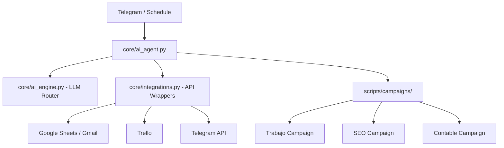

# 🤖 AI Agent - Esteban Selvaggi
### *Consultores en Servicios de Informática y Suministros de Informática*


Este agente de IA es un ecosistema de automatización diseñado para optimizar la gestión operativa, el seguimiento de objetivos y el posicionamiento digital de **Esteban Selvaggi**. No es solo un script de automatización, sino un orquestador inteligente que integra múltiples fuentes de datos y canales de comunicación.

---

## 🌟 Capacidades Principales

### 📈 Gestión de Productividad (Campaña "Trabajo")
El agente monitorea el flujo de trabajo diario, semanal y mensual:
- **Sincronización**: Lee objetivos desde Google Sheets y rastrea tarjetas en la lista "En Proceso" de Trello.
- **Reporting**: Genera y envía reportes automáticos vía Gmail detallando el avance real vs. el objetivo.

### 🌐 Posicionamiento Web & SEO
Automatización de la vigilancia digital para una cartera de dominios:
- **Auditorías Inteligentes**: Utiliza un motor de IA para generar resúmenes de auditoría SEO basados en datos de Google Search Console y GA4.
- **Escalabilidad**: Procesa múltiples dominios de forma secuencial y consolidada.

### 💰 Control Financiero (Campaña "Ejercicio Contable 2026")
Seguimiento riguroso de la salud financiera:
- **Trazabilidad**: Monitorea objetivos diarios, semanales y mensuales de facturación.
- **Alertas**: Notifica el estado de la facturación mensual para asegurar el cumplimiento de metas.

### 💬 Interfaz de Comando vía Telegram
El agente no solo es programado, es **interactivo**:
- **Decodificación de Intenciones**: Gracias a un router de LLM, el agente entiende instrucciones en lenguaje natural enviadas por Telegram.
- **Ejecución On-Demand**: Puedes solicitar la ejecución de cualquier campaña o reporte en tiempo real simplemente enviando un mensaje.

---

## 🏗️ Arquitectura del Sistema

El proyecto sigue un diseño modular basado en la separación de responsabilidades:



- **`core/`**: El motor lógico. Maneja la autenticación, el logging y el enrutamiento de IA.
- **`scripts/`**: La capa de ejecución. Contiene la lógica específica de cada campaña y herramientas de scraping.
- **`skills/`**: Base de conocimientos con estrategias y reglas de negocio.
- **`data/`**: Almacenamiento de configuraciones y memoria persistente.

---

## 🛠️ Stack Tecnológico

- **Lenguaje**: Python 3.10+
- **IA**: Gemini / OpenAI / Anthropic (vía `LLMRouter`)
- **Integraciones**: 
    - `google-api-python-client` (Sheets, Gmail)
    - `pytrello` (Trello)
    - `requests` (Telegram Bot API)
- **Entorno**: Windows (Task Scheduler)

---

## 🚀 Instalación y Configuración

### 1. Requisitos Previos
- Python 3.10 o superior instalado y en el PATH.
- Cuenta de Servicio de Google Cloud (JSON).
- API Key y Token de Trello.
- App Password de Gmail.
- Bot Token de Telegram (vía @BotFather).

### 2. Configuración
1. Clonar el repositorio:
   ```bash
   git clone https://github.com/selvaggiesteban/AI_Agent.git
   cd AI_Agent
   ```
2. Configurar variables de entorno:
   ```bash
   cp .env-example .env
   # Editar .env con tus credenciales reales
   ```
3. Instalar dependencias:
   ```bash
   pip install pandas google-api-python-client google-auth-oauthlib pytrello requests
   ```

### 3. Activación en Windows
Ejecutar el script de configuración como Administrador para programar las tareas (Lunes, Miércoles y Viernes a las 09:00 y 17:00):
```powershell
Set-ExecutionPolicy RemoteSigned -Scope Process
.\\setup_windows.ps1
```

---

## ⌨️ Modos de Uso

| Modo | Comando | Descripción |
| :--- | :--- | :--- |
| **Programado** | (Automático) | Ejecuta las campañas en las ventanas horarias definidas. |
| **Manual** | `python core/ai_agent.py --now` | Ejecuta todas las campañas inmediatamente. |
| **Interactivo** | `python core/ai_agent.py --listen` | Activa la escucha de comandos vía Telegram. |

---

## 📜 Convenciones del Proyecto

El agente opera bajo un marco de reglas estrictas documentadas en:
- **`AGENTS.md`**: Inventario de capacidades y servidores MCP.
- **`ENRICH_RULES.md`**: Reglas de validación de datos y limpieza de leads.
- **`ESTEBAN.md`**: Referencias y ecosistema de herramientas.

---

© 2026 Esteban Selvaggi - Engineering Excellence
