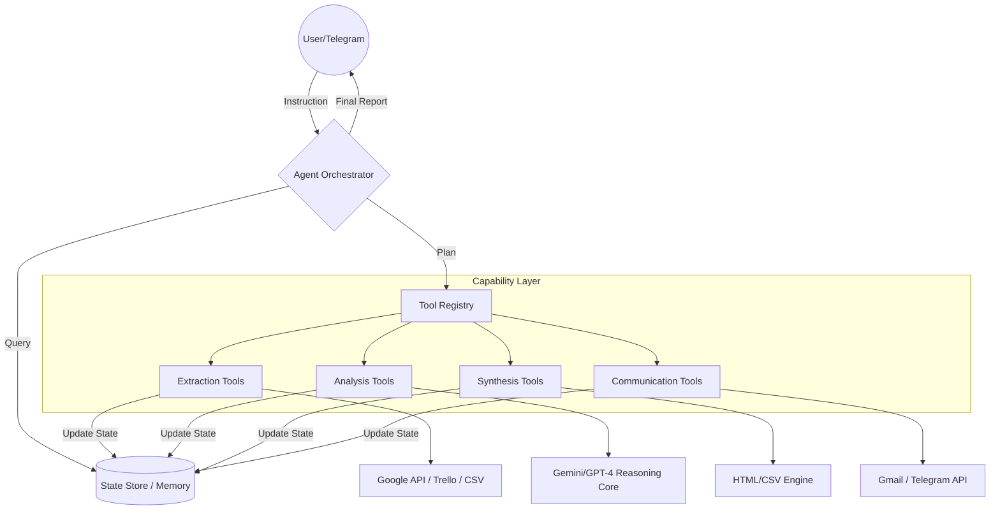

# AI Agent: Autonomous Business Orchestrator


## Vision
The **AI Agent** is not just a set of automation scripts; it is a **SOTA (State-of-the-Art) Agentic System**. It transitions from linear execution to **Goal-Oriented Orchestration**, combining perception, reasoning, and action to manage business operations, SEO positioning, and financial health autonomously.

---

## Agentic Architecture

The system is built on a modular, closed-loop architecture that separates intelligence from execution.



### Core Modules

The system is built on a modular architecture that separates intelligence from execution:

- **`core/ai_agent.py`**: Implements the `AgentOrchestrator`, the engine that executes the **Perceive $\rightarrow$ Plan $\rightarrow$ Act $\rightarrow$ Evaluate** loop.
- **`core/state.py`**: Persistent state management (`data/state.json`), allowing the agent to remember progress across sessions.
- **`core/tools.py`**: Central tool registry for the dynamic discovery of capabilities.

---

## Capability Library (The "Muscles")

The `skills/` directory serves as a massive command center:

- **Quantity**: 110 specialized skills physically implemented.
- **Distribution**: 5 thematic packs (Core Web, E-commerce, Growth, DevOps, Business Ops).
- **Standard**: Each skill is a Markdown file with YAML frontmatter and clear execution phases, ensuring that any new skill added is fully compatible with the orchestrator.

---

## Security & Configuration

- **Secrets**: All tokens and API keys reside exclusively in the `.env` file (excluded from Git via `.gitignore`).
- **References**: `LLM_PROVIDERS.md` now functions as a technical reference document without sensitive data.
- **Stack**: Full alignment with **Astro, Tailwind CSS, Cloudflare Pages/Functions, Resend, and Cloudflare Turnstile**.

---

## Key Capabilities

### 1. Financial Intelligence (Contable)
*   **Autonomous Analysis**: Reads real-time earnings from CSVs.
*   **Goal Tracking**: Calculates daily, weekly, and monthly targets.
*   **Visual Reporting**: Generates professional HTML reports with **dynamic progress bars**.

### 2. Digital Positioning (SEO)
*   **Metric Extraction**: Direct integration with Google Search Console and GA4.
*   **Technical Audits**: Automated SEO health checks for professional domains.
*   **Correlation**: Links traffic growth directly to business revenue.

### 3. Productivity Orchestration (Trabajo)
*   **Trello Sync**: Monitors "In Progress" cards to track real-time output.
*   **Google Sheets Integration**: Syncs high-level objectives with daily execution.
*   **Automated Briefs**: Sends personalized productivity summaries via email.

---

## Specialized Automation Catalog
Beyond the core orchestration, the system includes a vast library of specialized automated processes:

1.  **Lead Prospecting Pipeline** – Scraping Google Maps $\rightarrow$ combination of keywords/locations $\rightarrow$ deduplication $\rightarrow$ import to central SQLite
2.  **Multi-account Email Marketing Engine** – 10 rotating SMTP accounts, threading, drip campaigns, bounces, domain validation
3.  **IMAP Lead Detection Bot** – Monitors inbox, detects new senders, imports them to the contacts database
4.  **Email Campaign Launcher** – Segmentation by country (Spain/Argentina), list preparation, scheduled execution
5.  **Gmail Manager / Orchestrator** – Management of multiple Gmail accounts, activity reports, delivery control
6.  **WhatsApp Web RPA** – Playwright automates message sending via WhatsApp Web without an official API
7.  **Facebook Groups RPA** – Playwright automatically posts content in Facebook groups
8.  **Web Form Tester** – Fills and sends contact forms on websites for testing/contacting
9.  **SEO Content Generator** – Automatically generates SEO-optimized articles
10. **Landing Page Generator** – Creates complete landing pages from templates with customer data
11. **Automatic VPS Backup** – Executes full server backup, stores it, and reports result
12. **Database Audit** – Duplicate diagnosis, schema migration, complete audit
13. **Visual Contact Editor** – Streamlit app for contacts database CRUD
14. **WordPress SEO Crawler** – Analyzes WordPress sites, extracts SEO metrics, content structure
15. **Ecommerce Competitive Research** – Scrapes competitors, analyzes prices, catalogs, positioning
16. **AI Research Assistant** – Deep research on markets/trends using AI models
17. **Directory Scraping** – Kompass, Yellow Pages $\rightarrow$ business data extraction
18. **Long-tail Keyword Crawler** – Discovers and catalogs long-tail keywords for SEO
19. **Trello API (Read-only)** – Reads boards, cards, lists for project tracking
20. **Google Calendar API** – Reads/creates events for agenda management
21. **Accounting Dashboard** – Extracts data from ARCA/Santander/MercadoPago PDFs $\rightarrow$ HTML reports
22. **PDF Command Generator** – Creates command guides in PDF for clients
23. **Astro Site Deploy** – Development and deploy of selvaggiesteban.dev (Astro + Cloudflare)
24. **Telemetry / Consolidated Reports** – Generates activity reports for the entire system
25. **Client Services Pipeline** – Generation of contracts, site delivery, post-sale tracking
26. **Email Validation** – MailboxValidator integrated to clean contact lists
27. **List Quality Analysis** – Evaluates the health of email lists

---

## Installation & Setup

### 1. Prerequisites
- Python 3.10+
- Google Cloud Service Account (JSON)
- Trello API Key & Token
- Gmail App Password

### 2. Quick Start
```bash
# Clone the repository
git clone https://github.com/selvaggiesteban/AI_Agent.git
cd AI_Agent

# Setup environment variables
cp .env-example .env
# Edit .env with your real credentials

# Install dependencies
pip install pandas google-api-python-client google-auth-oauthlib pytrello requests google-generativeai
```

### 3. Execution Modes

| Mode | Command | Description |
| :--- | :--- | :--- |
| **Interactive** | `python core/ai_agent.py --listen` | 24/7 Telegram listener for natural language goals. |
| **Immediate** | `python core/ai_agent.py --now` | Runs a general system health check immediately. |
| **Scheduled** | `.\setup_windows.ps1` | Programs Windows Task Scheduler (Mon, Wed, Fri). |

---

## Project Conventions
The agent operates under a strict framework of professional rules:
- **`AGENTS.md`**: Inventory of agent roles and MCP servers.
- **`ENRICH_RULES.md`**: Data validation and lead cleaning rules.
- **`ESTEBAN.md`**: Technical references and ecosystem utility map.

## Legal Notice
This project is applicable before the **Agencia de Recaudación y Control (ARCA)** (formerly AFIP), with validity as of August 2026.
