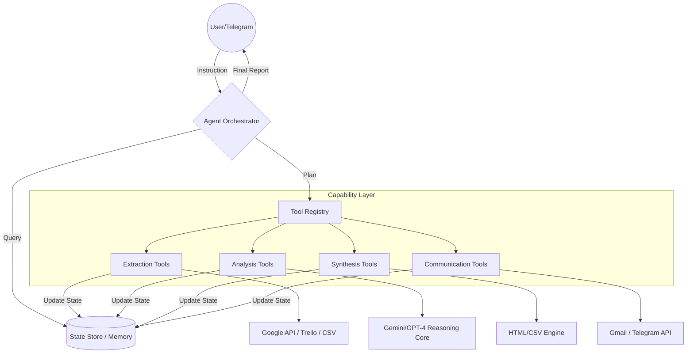

# 🤖 AI Agent: Autonomous Business Orchestrator


## 🌟 Vision
The **AI Agent** is not just a set of automation scripts; it is a **SOTA (State-of-the-Art) Agentic System**. It transitions from linear execution to **Goal-Oriented Orchestration**, combining perception, reasoning, and action to manage business operations, SEO positioning, and financial health autonomously.

---

## 🏗️ Agentic Architecture

The system is built on a modular, closed-loop architecture that separates intelligence from execution.



### 🧩 Core Modules

| Module | Responsibility | Key Feature |
| :--- | :--- | :--- |
| **Control Plane** | `core/state.py` | Persistent memory of metrics and execution history. |
| **Tool Registry** | `core/tools.py` | Decouples capabilities from the main loop. |
| **Reasoning Core** | `core/ai_agent.py` | Perceive $\rightarrow$ Plan $\rightarrow$ Act $\rightarrow$ Evaluate loop. |
| **Integrations** | `core/integrations.py` | Hardened wrappers for Google, Trello, and SMTP. |
| **Capabilities** | `core/capabilities/` | Specialized tools for Finance, SEO, and Productivity. |

---

## 🚀 Key Capabilities

### 📈 1. Financial Intelligence (Contable)
*   **Autonomous Analysis**: Reads real-time earnings from CSVs.
*   **Goal Tracking**: Calculates daily, weekly, and monthly targets.
*   **Visual Reporting**: Generates professional HTML reports with **dynamic progress bars**.

### 🌐 2. Digital Positioning (SEO)
*   **Metric Extraction**: Direct integration with Google Search Console and GA4.
*   **Technical Audits**: Automated SEO health checks for professional domains.
*   **Correlation**: Links traffic growth directly to business revenue.

### 🎯 3. Productivity Orchestration (Trabajo)
*   **Trello Sync**: Monitors "In Progress" cards to track real-time output.
*   **Google Sheets Integration**: Syncs high-level objectives with daily execution.
*   **Automated Briefs**: Sends personalized productivity summaries via email.

---

## 🛠️ Specialized Automation Catalog
Beyond the core orchestration, the system includes a vast library of specialized automated processes:

1.  **Pipeline de prospección de leads** – Scraping Google Maps $\rightarrow$ combinación de keywords/ubicaciones $\rightarrow$ deduplicación $\rightarrow$ importación a SQLite central
2.  **Motor de email marketing multicuenta** – 10 cuentas SMTP rotativas, threading, drip campaigns, rebotes, validación de dominios
3.  **Bot IMAP de detección de leads** – Monitorea inbox, detecta remitentes nuevos, los importa a la base de contactos
4.  **Lanzador de campañas de email** – Segmentación por país (España/Argentina), preparación de listas, ejecución programada
5.  **Gmail Manager / Orquestador** – Gestión de múltiples cuentas Gmail, reportes de actividad, control de envíos
6.  **WhatsApp Web RPA** – Playwright automatiza envío de mensajes por WhatsApp Web sin API oficial
7.  **Facebook Groups RPA** – Playwright postea contenido en grupos de Facebook automáticamente
8.  **Testeador de formularios web** – Llena y envía formularios de contacto de sitios web para testear/contactar
9.  **Generador de contenido SEO** – Genera artículos SEO optimizados automáticamente
10. **Generador de landing pages** – Crea landing pages completas desde templates con datos del cliente
11. **Backup automático del VPS** – Ejecuta backup completo del servidor, lo almacena y reporta
12. **Auditoría de base de datos** – Diagnóstico de duplicados, migración de schema, auditoría completa
13. **Editor visual de contactos** – Streamlit app para CRUD de la base de contactos
14. **Crawler SEO WordPress** – Analiza sitios WordPress, extrae métricas SEO, estructura de contenido
15. **Investigación competitiva ecommerce** – Scrapea competidores, analiza precios, catálogos, posicionamiento
16. **Asistente de research con IA** – Investigación profunda de mercados/tendencias usando modelos de IA
17. **Scraping de directorios** – Kompass, Páginas Amarillas $\rightarrow$ extracción de datos empresariales
18. **Crawler de keywords long-tail** – Descubre y cataloga keywords long-tail para SEO
19. **API Trello (lectura)** – Lee boards, cards, lists para seguimiento de proyectos
20. **API Google Calendar** – Lee/crea eventos para gestión de agenda
21. **Dashboard contable** – Extrae datos de PDFs ARCA/Santander/MercadoPago $\rightarrow$ reportes HTML
22. **Generador de comandos PDF** – Crea guías de comandos en PDF para clientes
23. **Sitio Astro deploy** – Desarrollo y deploy de selvaggiesteban.dev (Astro + Cloudflare)
24. **Telemetry / Reportes consolidados** – Genera reportes de actividad de todo el sistema
25. **Pipeline de servicios a clientes** – Generación de contratos, entrega de sitios, seguimiento post venta
26. **Validación de emails** – MailboxValidator integrado para limpiar listas de contactos
27. **Análisis de calidad de listas** – Evalúa salud de listas de email

---

## 🛠️ Installation & Setup

### 1. Prerequisites
- Python 3.10+
- Google Cloud Service Account (JSON)
- Trello API Key & Token
- Gmail App Password

### 2. Quick Start
```bash
# Clone the repository
git clone https://github.com/selvaggiesteban/AI_Agent.git
cd AI_Agent

# Setup environment variables
cp .env-example .env
# Edit .env with your real credentials

# Install dependencies
pip install pandas google-api-python-client google-auth-oauthlib pytrello requests google-generativeai
```

### 3. Execution Modes

| Mode | Command | Description |
| :--- | :--- | :--- |
| **Interactive** | `python core/ai_agent.py --listen` | 24/7 Telegram listener for natural language goals. |
| **Immediate** | `python core/ai_agent.py --now` | Runs a general system health check immediately. |
| **Scheduled** | `.\setup_windows.ps1` | Programs Windows Task Scheduler (Mon, Wed, Fri). |

---

## 📜 Project Conventions
The agent operates under a strict framework of professional rules:
- **`AGENTS.md`**: Inventory of agent roles and MCP servers.
- **`ENRICH_RULES.md`**: Data validation and lead cleaning rules.
- **`ESTEBAN.md`**: Technical references and ecosystem utility map.

## ⚖️ Legal Notice
This project is applicable before the **Agencia de Recaudación y Control (ARCA)** (formerly AFIP), with validity as of August 2026.
