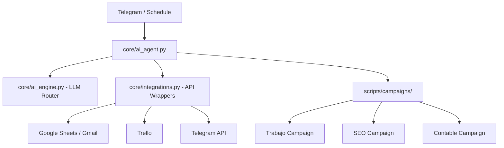

# 🤖 AI Agent - Esteban Selvaggi
### *Consultores en Servicios de Informática y Suministros de Informática*


This AI Agent is a comprehensive automation ecosystem designed to optimize operational management, goal tracking, and digital positioning for **Esteban Selvaggi**. It is an intelligent orchestrator that integrates multiple data sources and communication channels to maintain business continuity and growth.

---

## 🎯 Project Scope & Capabilities

The agent is designed to operate on a strict schedule: **Mondays, Wednesdays, and Fridays at 09:00 and 17:00**, executing the following core functions:

### 📈 1. Work Productivity Management ("Trabajo")
Full synchronization between goal setting and execution:
- **Google Sheets Integration**: Reads and writes daily, weekly, and monthly goals for `selvaggiesteban@gmail.com`.
- **Trello Board Management**: Monitors the "Esteban Selvaggi" board, specifically tracking and reading cards in the **"En Proceso" (In Progress)** list.
- **Automated Reporting**: Generates and sends personalized emails using predefined templates, summarizing:
  - Current Date of delivery.
  - Daily, Weekly, and Monthly goals.
  - Real-time list of tasks currently in progress.

### 🌐 2. Digital Positioning & SEO ("Posicionamiento Web")
Automated vigilance and auditing of a professional web portfolio:
- **Data Sources**: Integrates **Google Search Console (GSC)** and **Google Analytics 4 (GA4)**.
- **Automated Audits**: Performs technical SEO audits for a portfolio of 14 domains including:
  - `gsrabogados.com.ar`, `oteguiobras.com`, `zingueriazarza.com`, `decotay.com.ar`, `tay.com.ar`, `mottobasic.com`, `selvaggiesteban.dev`, `lanuscomputacion.com`, `selvaggiconsultores.com`, `ingenieriaproyectos.com.ar`, `identidadmarketing.com`, `mueblescavah.com.ar`, `muebles-cavah.com.ar`, `smartalk.cl`.
- **Delivery**: Consolidates all findings into a professional audit report delivered via email.

### 💰 3. Financial Oversight ("Ejercicio Contable 2026")
Strict monitoring of financial health and targets for the 2026 fiscal year:
- **Metric Tracking**: Calculates and monitors daily, weekly, and monthly financial objectives.
- **Earnings Analysis**: Tracks monthly billing (facturación mensual) vs. targets.
- **Visual Reporting**: Generates reports with visual progress indicators of financial achievements.

### 🔌 4. Omni-channel Data Integration
The agent possesses the capability to read and write across a vast array of data sources:
- **Productivity**: Trello, Gmail, Google Sheets.
- **Analytics**: Google Search Console, Google Analytics 4, YouTube.
- **Communication**: Telegram, WhatsApp, Instagram, Facebook, X (Twitter), LinkedIn.

---

## 🌐 Integrated Ecosystem

The agent leverages a curated set of specialized toolsets to extend its capabilities:

- **[AI Specialization Suite](data/inputs/LLM/)**: A collection of purpose-built AI agents for domain-specific tasks, including:
  - **Domain QA & Contract Analysis**: Automated legal and technical auditing.
  - **Intelligence Agents**: Meeting summarizers, review intelligence, and memory agents.
  - **Development Bots**: Code suggestors and automated code review tools.


---

## 🏗️ System Architecture

The project follows a modular design based on the separation of concerns:



- **`core/`**: The logic engine. Handles authentication, logging, and AI routing.
- **`scripts/`**: The execution layer. Contains specific campaign logic and scraping tools.
- **`skills/`**: Knowledge base with strategies and business rules.
- **`data/`**: Storage for configurations and persistent memory.

---

## 🛠️ Tech Stack

- **Language**: Python 3.10+
- **AI**: Gemini / OpenAI / Anthropic (via `LLMRouter`)
- **Integrations**: 
    - `google-api-python-client` (Sheets, Gmail)
    - `pytrello` (Trello)
    - `requests` (Telegram Bot API)
- **OS**: Windows (via Task Scheduler)

---

## 🚀 Installation & Setup

### 1. Prerequisites
- Python 3.10+ installed and added to PATH.
- Google Cloud Service Account (JSON).
- Trello API Key and Token.
- Gmail App Password.
- Telegram Bot Token (via @BotFather).

### 2. Configuration
1. Clone the repository:
   ```bash
   git clone https://github.com/selvaggiesteban/AI_Agent.git
   cd AI_Agent
   ```
2. Configure environment variables:
   ```bash
   cp .env-example .env
   # Edit .env with your actual credentials
   ```
3. Install dependencies:
   ```bash
   pip install pandas google-api-python-client google-auth-oauthlib pytrello requests
   ```

### 3. Windows Activation
Run the setup script as Administrator to create the 6 scheduled tasks (Mon, Wed, Fri at 09:00 and 17:00):
```powershell
Set-ExecutionPolicy RemoteSigned -Scope Process
.\\setup_windows.ps1
```

---

## ⌨️ Usage Modes

| Mode | Command | Description |
| :--- | :--- | :--- |
| **Scheduled** | (Automatic) | Runs campaigns in defined time windows. |
| **Manual** | `python core/ai_agent.py --now` | Executes all campaigns immediately. |
| **Interactive** | `python core/ai_agent.py --listen` | Activates Telegram command listening. |

---

## 📜 Project Conventions

The agent operates under a strict framework of rules documented in:
- **`AGENTS.md`**: Inventory of capabilities and MCP servers.
- **`ENRICH_RULES.md`**: Data validation and lead cleaning rules.
- **`ESTEBAN.md`**: Technical references and utility ecosystem.

---

© 2026 Esteban Selvaggi - Engineering Excellence
