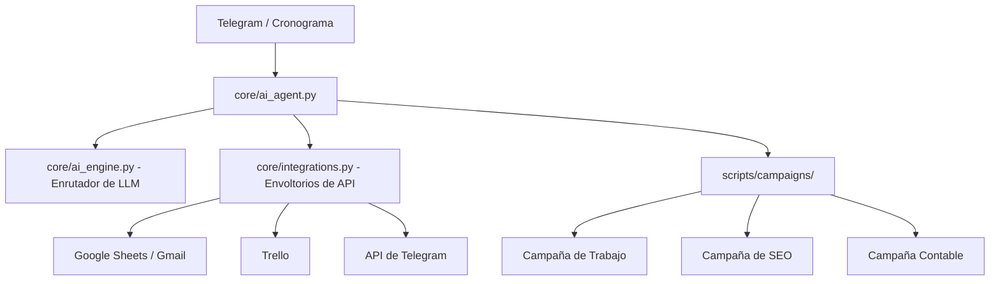

# AI Agent - Esteban Selvaggi
### *CONSULTORES EN INFORMÁTICA Y SUMINISTROS DE PROGRAMAS DE INFORMÁTICA*


Este Agente de Inteligencia Artificial es un ecosistema de automatización integral diseñado para optimizar la gestión operativa, el seguimiento de objetivos y el posicionamiento digital de **Esteban Selvaggi**. Es un orquestador inteligente que integra múltiples fuentes de datos y canales de comunicación para mantener la continuidad y el crecimiento del negocio.

---

## ⚖️ Alcance Legal
Este proyecto posee alcance legal y es aplicable ante la **Agencia de Recaudación y Control (ARCA)**, anteriormente conocida como **Administración Federal de Ingresos Públicos (AFIP)**, con vigencia a agosto de 2026.

---

## 🎯 Alcance y Capacidades del Proyecto

El agente está diseñado para operar bajo un cronograma estricto: **lunes, miércoles y viernes a las 09:00 y a las 17:00**, ejecutando las siguientes funciones principales:

### 📈 1. Gestión de la Productividad Laboral ("Trabajo")
Sincronización total entre la definición de objetivos y su ejecución:
- **Integración con Google Sheets**: Lee y escribe objetivos diarios, semanales y mensuales para `selvaggiesteban@gmail.com`.
- **Gestión de Tablero de Trello**: Monitorea el tablero "Esteban Selvaggi", rastreando y leyendo específicamente las tarjetas en la lista **"En Proceso"**.
- **Informes Automatizados**: Genera y envía correos electrónicos personalizados utilizando plantillas predefinidas, resumiendo:
  - Fecha actual de entrega.
  - Objetivos diarios, semanales y mensuales.
  - Lista en tiempo real de las tareas actualmente en proceso.

### 🌐 2. Posicionamiento Digital y SEO ("Posicionamiento Web")
Vigilancia y auditoría automatizada de un portafolio web profesional:
- **Fuentes de Datos**: Integra **Google Search Console (GSC)** y **Google Analytics 4 (GA4)**.
- **Auditorías Automatizadas**: Realiza auditorías técnicas de SEO para un portafolio de dominios profesionales.
- **Entrega**: Consolida todos los hallazgos en un informe de auditoría profesional enviado por correo electrónico.

### 💰 3. Supervisión Financiera ("Ejercicio Contable 2026")
Monitoreo estricto de la salud financiera y los objetivos para el año fiscal 2026:
- **Seguimiento de Métricas**: Calcula y monitorea los objetivos financieros diarios, semanales y mensuales.
- **Análisis de Ganancias**: Rastrea la facturación mensual frente a los objetivos establecidos.
- **Informes Visuales**: Genera informes con indicadores visuales de progreso de los logros financieros.

### 🔌 4. Integración de Datos Omnicanal
El agente posee la capacidad de leer y escribir en una vasta gama de fuentes de datos:
- **Productividad**: Trello, Gmail, Google Sheets.
- **Analítica**: Google Search Console, Google Analytics 4, YouTube.
- **Comunicación**: Telegram, WhatsApp, Instagram, Facebook, X (Twitter), LinkedIn.

### 🚀 5. Servicios Especializados de IA (Catálogo Expandido)
El agente integra un ecosistema de campañas avanzadas para la generación de activos digitales y consultoría técnica:
- **Chatbot WordPress**: Diseño y plan de implementación de asistentes inteligentes para sitios WP.
- **Auditoría SEO Profunda**: Análisis técnico exhaustivo con priorización de impacto y sugerencias de corrección.
- **Optimización de Páginas WordPress**: Auditoría de UX/UI y CRO (Conversion Rate Optimization) para landing pages.
- **Creador de Anuncios con IA**: Generación de copys de alta conversión para Facebook, Instagram y Google Ads.
- **Optimización de Catálogos E-commerce**: Estructuración de títulos y descripciones optimizadas para tiendas online.
- **Roadmap de Automatizaciones con IA**: Identificación de flujos manuales y diseño de arquitecturas de automatización RPA/LLM.
- **E-mail Marketing con IA**: Orquestación de secuencias de correos personalizados y persuasivos.

---

## 🌐 Ecosistema Integrado

El agente utiliza un conjunto seleccionado de herramientas especializadas para extender sus capacidades:

- **[Suite de Especialización en IA](data/inputs/LLM/)**: Una colección de agentes de inteligencia artificial creados para tareas específicas de dominio, incluyendo:
  - **Análisis de Contratos y Aseguramiento de Calidad de Dominios**: Auditoría legal y técnica automatizada.
  - **Agentes de Inteligencia**: Resumidores de reuniones, inteligencia de revisiones y agentes de memoria.
  - **Bots de Desarrollo**: Sugeridores de código y herramientas de revisión de código automatizadas.

---

## 🏗️ Arquitectura del Sistema

El proyecto sigue un diseño modular basado en la separación de responsabilidades:



- **`core/`**: El motor lógico. Maneja la autenticación, el registro de eventos y el enrutamiento de la inteligencia artificial.
- **`scripts/`**: La capa de ejecución. Contiene la lógica de campañas específicas y herramientas de extracción de datos.
- **`skills/`**: Base de conocimientos con estrategias y reglas de negocio.
- **`data/`**: Almacenamiento de configuraciones y memoria persistente.

---

## 🛠️ Stack Tecnológico

- **Lenguaje**: Python 3.10 o superior.
- **Inteligencia Artificial**: Gemini / OpenAI / Anthropic (vía `LLMRouter`).
- **Integraciones**: 
    - `google-api-python-client` (Sheets, Gmail).
    - `pytrello` (Trello).
    - `requests` (API de Bot de Telegram).
- **Sistema Operativo**: Windows (vía Programador de Tareas).

---

## 🚀 Instalación y Configuración

### 1. Requisitos Previos
- Python 3.10 o superior instalado y agregado al PATH.
- Cuenta de Servicio de Google Cloud (JSON).
- Clave de API y Token de Trello.
- Contraseña de Aplicación de Gmail.
- Token de Bot de Telegram (vía @BotFather).

### 2. Configuración
1. Clonar el repositorio:
   ```bash
   git clone https://github.com/selvaggiesteban/AI_Agent.git
   cd AI_Agent
   ```
2. Configurar variables de entorno:
   ```bash
   cp .env-example .env
   # Editar .env con sus credenciales reales
   ```
3. Instalar dependencias:
   ```bash
   pip install pandas google-api-python-client google-auth-oauthlib pytrello requests
   ```

### 3. Activación en Windows
Ejecutar el script de configuración como Administrador para crear las 6 tareas programadas (lunes, miércoles y viernes a las 09:00 y a las 17:00):
```powershell
Set-ExecutionPolicy RemoteSigned -Scope Process
.\\setup_windows.ps1
```

---

## ⌨️ Modos de Uso

| Modo | Comando | Descripción |
| :--- | :--- | :--- |
| **Programado** | (Automático) | Ejecuta las campañas en las ventanas de tiempo definidas. |
| **Manual** | `python core/ai_agent.py --now` | Ejecuta todas las campañas inmediatamente. |
| **Interactivo** | `python core/ai_agent.py --listen` | Activa la escucha de comandos de Telegram. |

---

## 💻 Comandos para Terminal

### 🛠️ 1. Configuración Inicial y Entorno
Para preparar el proyecto por primera vez o reinstalar dependencias:

```bash
# Clonar el repositorio
git clone https://github.com/selvaggiesteban/AI_Agent.git
cd AI_Agent

# Crear el archivo de variables de entorno desde el ejemplo
cp .env-example .env

# Instalar las dependencias de Python
pip install pandas google-api-python-client google-auth-oauthlib pytrello requests
```

### 🚀 2. Activación en Windows (Administrador)
Para programar las ejecuciones automáticas (lunes, miércoles y viernes a las 9 y 17 h), abre una terminal de **PowerShell como Administrador**:

```powershell
# Cambiar política de ejecución para permitir el script
Set-ExecutionPolicy RemoteSigned -Scope Process

# Ejecutar el script de configuración de tareas programadas
.\\setup_windows.ps1
```

### ⌨️ 3. Modos de Ejecución Manual
Para ejecutar el agente fuera del horario programado:

```bash
# EJECUCIÓN INMEDIATA: Corre todas las campañas ahora mismo
python core/ai_agent.py --now

# MODO ESCUCHA: Activa la escucha de comandos vía Telegram (Modo 24/7)
python core/ai_agent.py --listen
```

### 📁 4. Gestión de Git y Repositorio
Para mantener el código actualizado y sincronizado con GitHub:

```bash
# Guardar cambios locales
git add .
git commit -m "Descripción de los cambios"

# Subir cambios a GitHub
git push origin main

# Actualizar la copia local desde GitHub
git pull origin main
```

### 📜 5. Mantenimiento y Monitoreo
Para revisar el estado del agente y los errores:

```bash
# Ver los logs más recientes (en Linux/Bash)
tail -f logs/ai_agent.log

# Listar archivos en la carpeta de datos para verificar salidas
ls -R data/outputs
```

### ⚠️ Nota Importante sobre `.env`
Recuerda que el archivo `.env` contiene tus claves privadas y **no debe subirse a GitHub**. Asegúrate de que esté listado en el `.gitignore` antes de hacer cualquier `git push`.

---

## 📜 Convenciones del Proyecto


El agente opera bajo un marco estricto de reglas documentadas en:
- **`AGENTS.md`**: Inventario de capacidades y servidores MCP.
- **`ENRICH_RULES.md`**: Reglas de validación de datos y limpieza de prospectos.
- **`ESTEBAN.md`**: Referencias técnicas y ecosistema de utilidades.

---

## 📋 Especificaciones Técnicas y Requerimientos

Requisitos:
- Sistema de log
- Repositorio en GitHub
- Configurar en Windows
- Activar en Windows
- Compartir en Windows

Alcance:
- Leer / Escribir TRABAJO - Hojas de cálculo de Google selvaggiesteban@gmail.com lunes, miércoles y viernes a las 9 y 17 h.
- Leer / Escribir tarjetas de tablero Esteban Selvaggi en Trello lunes, miércoles y viernes a las 9 y 17 h. 
- Leer / Escribir e-mails de y para selvaggiesteban@gmail.com con plantillas predefindas lunes, miércoles y viernes a las 9 y 17 h. 
- Leer / Escribir fuentes de datos: Google Search Console, Google Analytics 4, Trello, Gmail, YouTube, Telegram, WhatsApp, Instagram, Facebook, X, LinkedIn. 
- Campaña Trabajo con fecha de inicio 14 de agosto 2026, título Trabajo, asunto Trabajo, mensaje: %fecha del envío del mensaje%. El trabajo del día es: Objetivo Diario: %objetivo diairo% Objetivo semanal: %objetivo semanal% Objetivo mensual: %objetivo mensual% Tareas en Proceso: %tarjetas de Trello en lista En Proceso%.
- Campaña Posicionamiento web con fecha de inicio 14 de agosto 2026, titulo Posicionamiento web, asunto Posicionamiento web, mensaje Auditorías SEO: %auditoria SEO cliente 1% %auditoria SEO cliente 2% etc.
- Campaña Ejercicio contable 2026 con fecha de inicio 14 de agosto 2026, título Ejercicio contable 2026, asunto Ejercicio contable 2026, mensaje Objetivo diario %objetivo diario% Objetivo semanal %objetivo semanal% Objetivo mensual %objetivo mensual% Facturación mensual %facturacion mensual% 
- Campañas Especializadas de IA: Implementación de Chatbot WP, Auditoría SEO Profunda, Optimización de Páginas WP, Creador de Anuncios con IA, Catálogo de Tienda Online, Automatizaciones con IA y E-mail Marketing con IA.
- Generación de Entregables Profesionales: Capacidad de adjuntar reportes detallados en formato HTML (con indicadores visuales de progreso) y archivos de datos en formato CSV.

Incluir 
- AGENTS.md 
- ENRICH_RULES.md
- ESTEBAN.md
- .env-example para .env
- skills
- scripts
- core
- .claude
- .github
- .opencode
- data
- logs


